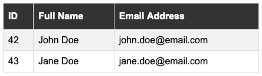

# JSON 2 HTML Table Converter

Converts this:

```json
{
    "headers": {
        "id": "ID",
        "name": "Full Name",
        "email": "Email Address"
    },
    "data": [
        {
            "id": 42,
            "name": "John Doe",
            "email": "john.doe@email.com"
        },
        {
            "id": 43,
            "name": "Jane Doe",
            "email": "jane.doe@email.com"
        }
    ]
}
```

into this:



## Usage

```typescript
import { IJson2HtmlTableOptions, json2HtmlTable } from "./lib/Json2HtmlTableConverter"

const options: IJson2HtmlTableOptions = {
    headers: {
        id: "ID",
        name: "Full Name",
        email: "Email Address"
    },
    data: [
        {
            id: 42,
            name: "John Doe",
            email: "john.doe@email.com"
        },
        {
            id: 43,
            name: "Jane Doe",
            email: "jane.doe@email.com"
        }
    ]
}

json2HtmlTable(options)
```

## License

See [LICENSE](./LICENSE) file.
